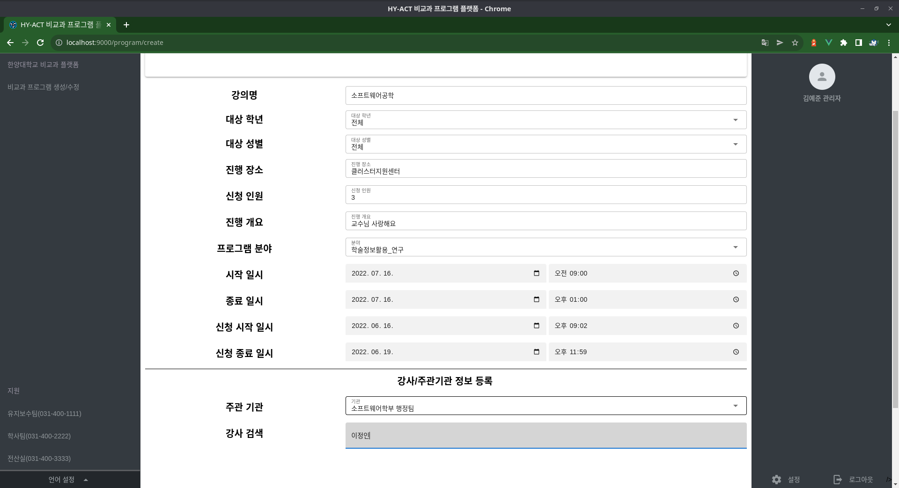

# HY-Act
HY-Act는 한양대학교 비교과 프로그램 서비스입니다.

## 환경 설정
### 테스트된 환경
* Ubuntu 22.04
* CPU : AMD 3700X

### 필요한 패키지
* Docker 및 Docker-compose

### 서비스 실행
* 현 저장소를 로컬로 복제합니다
```bash
git clone https://github.com/SE2022-Group4/hy-act
```

* 복제한 폴더로 이동합니다
```bash
cd hy-act
```

* docker-compose를 통해 백엔드 및 프론트엔드 컨테이너를 실행합니다.
```bash
docker-compose up --build
```

## 시제품 사용
1. http://localhost:9000 으로 접속합니다.
2. 기존에 로그인되어 있지 않은 경우 /login 페이지로 자동으로 이동하게 됩니다.


3. 각 사용자의 계정 정보는 다음과 같습니다.

|사용자 그룹|계정|비밀번호|
|------|---|---|
|학생|student_1|Qoswlfdlsnrn|
|교강사|lecturer_1|Qoswlfdlsnrn|
|관리자|admin_1|Qoswlfdlsnrn|

### 프로그램 개설 및 삭제
1. 관리자의 경우, 서비스 메인 화면은 전체 개설된 목록으로 이동합니다.


2. 좌측 메뉴에서 비교과 프로그램 생성/수정을 선택합니다.
3. 프로그램 이름, 인원, 장소, 개요, 교강사를 입력합니다.
(단, 강사 검색과 같은 경우, 입력기에 따라 검색이 제대로 이루어지지 않으나 오른쪽 화살표를 눌러서 커서를 옮긴 후 검색 결과를 선택하시면 됩니다.)



4. 등록이 정상적으로 완료되면 1에서 보인 페이지로 돌아오고 추가된 프로그램이 보입니다.

5. 4번 화면에서 프로그램 항목의 취소하기 버튼을 누르면 프로그램 목록에서 삭제할 수 있습니다.


### 프로그램 신청
1. 학생의 경우, 서비스 메인 화면은 신청할 수 있는 프로그램 항목으로 이동합니다.


2. 각 프로그램 항목의 신청하기 버튼을 누르면 신청할 수 있습니다.


2-1. 이미 신청한 프로그램인 경우 아래와 같이 경고를 표시하고 신청을 처리하지 않습니다.


2-2. 신청 기간이 아닌 경우 아래와 같이 경고를 표시하고 신청을 처리하지 않습니다.


3. 신청이 진행된 경우 아래와 같이 취소할 수 있는 목록에서 확인할 수 있습니다.


### 교강사 출석 관리
1. 교강사의 경우, 서비스 메인 화면은 자신이 진행할 프로그램 항목으로 이동합니다.


2. 프로그램 항목의 출석 관리하기 버튼을 클릭합니다.

3. 아래 이미지와 같이 출석 번호 발급 및 현재 출석 인증 현황을 확인할 수 있습니다.


4. 학생이 시작 및 종료 인증 코드를 입력하면 아래 표가 체크 형식으로 변하게 됩니다.
(현황 새로고침 버튼을 사용하면 새로고침 없이 표를 변경할 수 있습니다.)


### 프로그램 출석 인증
1. 학생이 프로그램을 신청한 경우, 프로그램 신청 목록에서 확인할 수 있습니다.


2. 교강사가 발급한 출석 코드를 제출하면 출석이 인증 처리가 됩니다.

